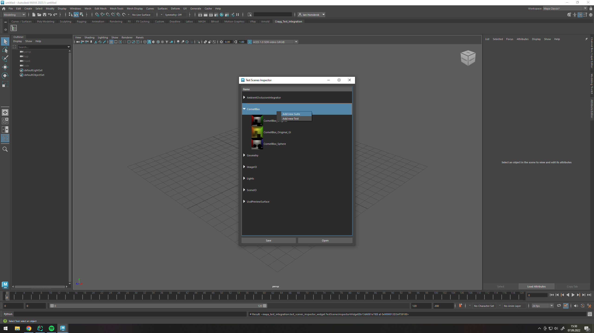

Personal Raytracer project started to get familiar with C++ in general and how to do CI and TDD in C++.


Cornell Box by http://casual-effects.com/data/index.html

<!-- TOC -->
* [crayg](#crayg)
  * [Features](#features)
    * [Rendering related features](#rendering-related-features)
    * [Project features not related to rendering](#project-features-not-related-to-rendering)
  * [Build the project](#build-the-project)
    * [Prerequisites](#prerequisites)
    * [Build](#build)
      * [Linux & Mac OS](#linux--mac-os)
      * [Windows](#windows)
  * [Test execution](#test-execution)
  * [Development Setup](#development-setup)
  * [Test Integration for Autodesk Maya](#test-integration-for-autodesk-maya)
    * [Prerequisites](#prerequisites)
    * [Launching and Usage](#launching-and-usage)
      * [Functions](#functions)
        * [Open](#open)
        * [Save](#save)
        * [Create a new Suite or Test](#create-a-new-suite-or-test)
<!-- TOC -->

## Features

### Rendering related features

- Sphere / Trianglemesh intersection
- PointInstancer (Single-Level Instancing)
- Area lights (Rect and Disk)
- perfect reflections
- diffuse reflections / GI
- [Intel Embree](https://github.com/embree/embree) based BVH
- Adaptive sampling inspired by [Dreamwork's Implementation](https://research.dreamworks.com/wp-content/uploads/2019/10/adaptive.pdf) of the paper by [Dammertz et al.](https://jo.dreggn.org/home/2009_stopping.pdf)
- multiple integrators:
  - Raytracing
  - Ambient Occlusion
  - Debug (Simple "N Dot V shading", inspired
    by [Renderman's PxrVisualizer](https://rmanwiki.pixar.com/display/REN24/PxrVisualizer)))
- Basic support for Subdivision Surfaces using [OpenSubdiv](https://github.com/PixarAnimationStudios/OpenSubdiv)
- Scene format uses USD, with basic respect
  for [UsdRender](https://graphics.pixar.com/usd/release/api/usd_render_page_front.html)
- CLI interface
- Qt based Renderview GUI

### Project features not related to rendering

- Unittests
- Integrationtests using [Cato](https://github.com/Latios96/cato)
- Continuous Integration using Github Actions
- support for Windows, Linux and Mac OS
- fully automated CMake build
- Support for CMake Unity builds
- Dependency Management using [Conan](https://conan.io/)
  - Conan Recipes for OpenSubdiv ([available](https://conan.io/center/opensubdiv) in Conan Center) and USD (to be
    contributed to Conan Center)
- Autodesk Maya GUI integration for easy authoring of integration test
  scenes [(more details)](#test-integration-for-autodesk-maya)

## Build the project

### Prerequisites

- Conan Package Manager, get it [here](https://conan.io/downloads.html)
- CMake
- A C++ 17 compiler
- (access to my custom USD Conan recipe)

The invocation of Conan is handled transparently by CMake

### Build

For better buid speed, it is recommended to do a CMake unity build by
specifying `-DCMAKE_UNITY_BUILD=true -DCMAKE_UNITY_BUILD_BATCH_SIZE=16`

#### Linux & Mac OS

```shell
mkdir build
cd build
cmake -DCMAKE_BUILD_TYPE=Release -DCMAKE_UNITY_BUILD=true -DCMAKE_UNITY_BUILD_BATCH_SIZE=16 ..
make -j 4
```

#### Windows

```shell
mkdir build
cd build
cmake -G "Visual Studio 16 2019" -DCMAKE_BUILD_TYPE=Release -DCMAKE_UNITY_BUILD=true -DCMAKE_UNITY_BUILD_BATCH_SIZE=16 ..
cmake --build . --config Release -- /M:%NUMBER_OF_PROCESSORS%
```

Alternatively, you can also use Ninja:

```shell
mkdir build
cd build
call "C:\Program Files (x86)\Microsoft Visual Studio\2019\Community\VC\Auxiliary\Build\vcvarsall.bat" x64
cmake -G "Ninja" .. -DCMAKE_BUILD_TYPE=Release
ninja
```

## Test execution

```shell
cd build
ctest -V
```

## Development Setup
```shell
# you may want to use a virtualenv
pip install -r requirements-dev.txt
pre-commit install
git config blame.ignoreRevsFile .git-blame-ignore-revs
```

## Test Integration for Autodesk Maya

Qt / Python based tool for easy authoring of integration test scenes inside of Autodesk Maya

For each test, a Maya `.ma` file and a `.usda` file is stored

### Prerequisites

Currently, Autodesk Maya 2023 is supported.
You need to have the [maya-usd](https://github.com/Autodesk/maya-usd) installed

Make sure to install the Python dependencies inside Maya:

```shell
C:\Program Files\Autodesk\Maya2023\bin\mayapy -m requirements.txt
```

### Launching and Usage

Start Maya with the test integration via command line:

```shell
cd src\mayaTestIntegration
start_maya.bat
```

When Maya is open, a new Shelf is added. Use the Inspector Icon to launch the test integration:


The Test Integration will present you the suites / tests as a tree view


#### Functions

##### Open

Opens the .ma file associated with the test

##### Save

Saves the currently open test as a `.ma` file and exports scene to `.usda`

##### Create a new Suite or Test

Suite: right-click into tree view
Test: right-click on a suite




