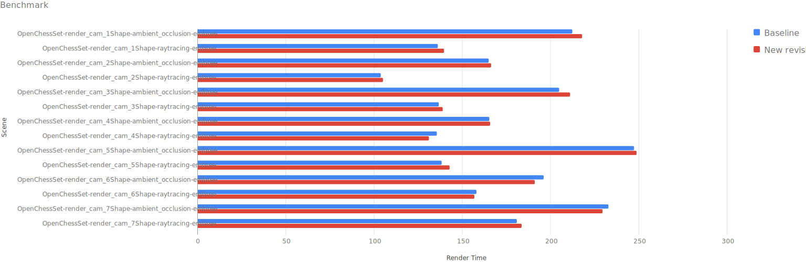
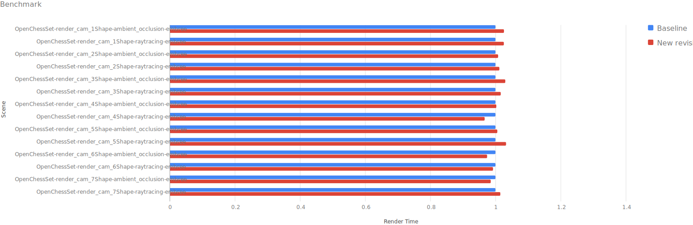
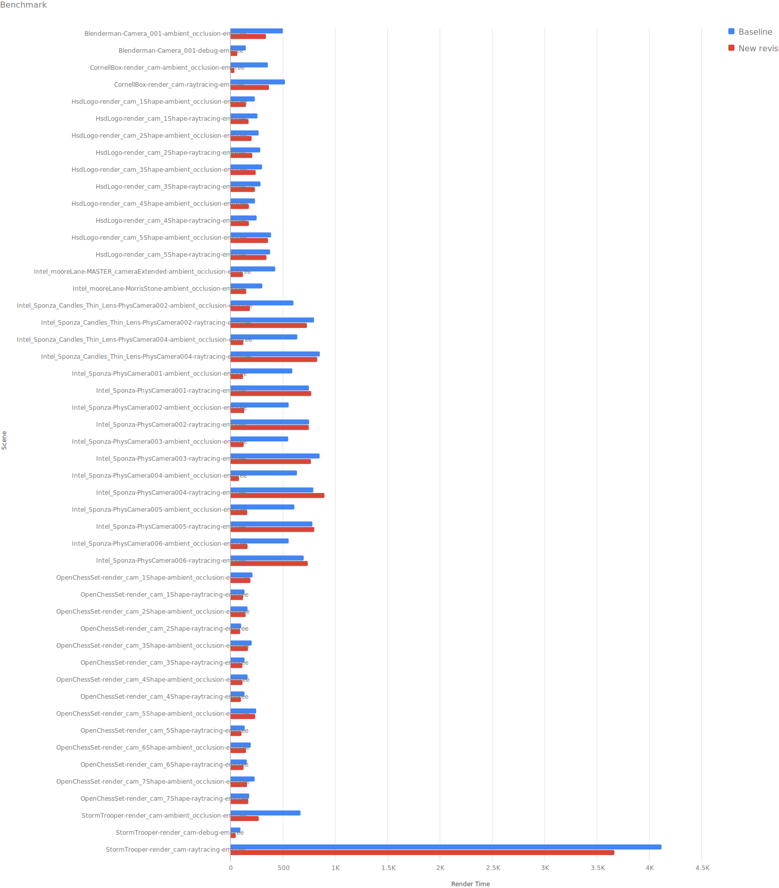
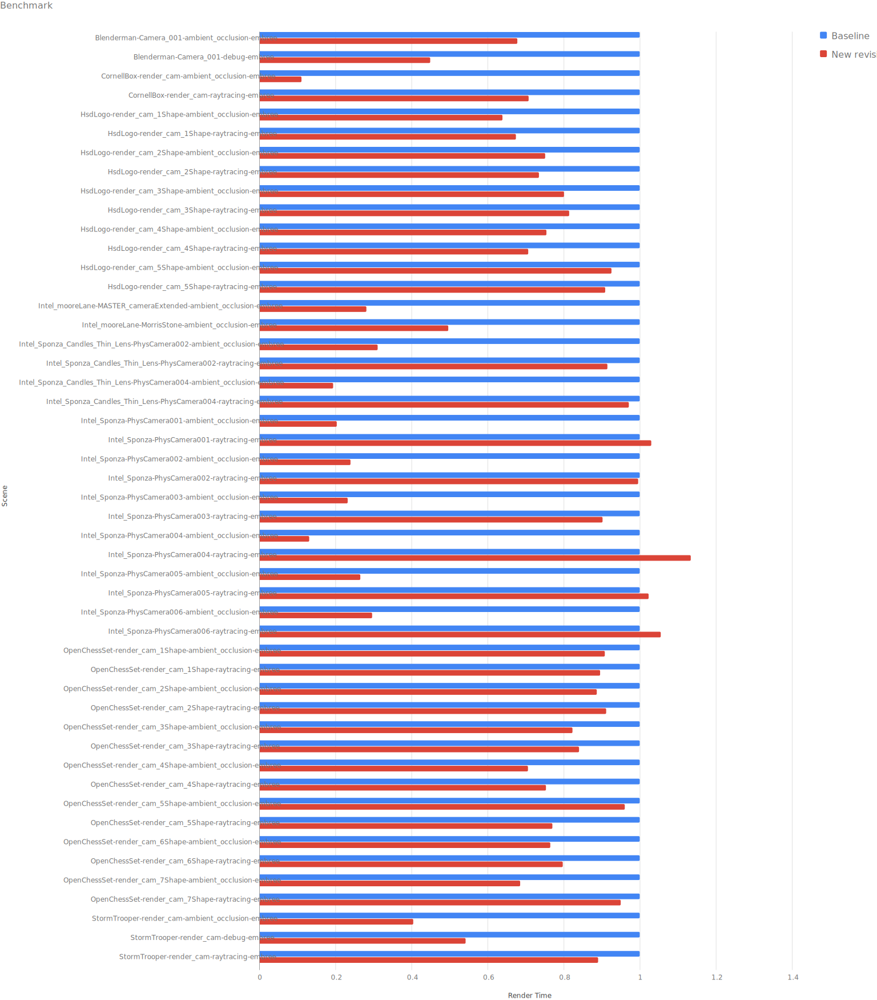
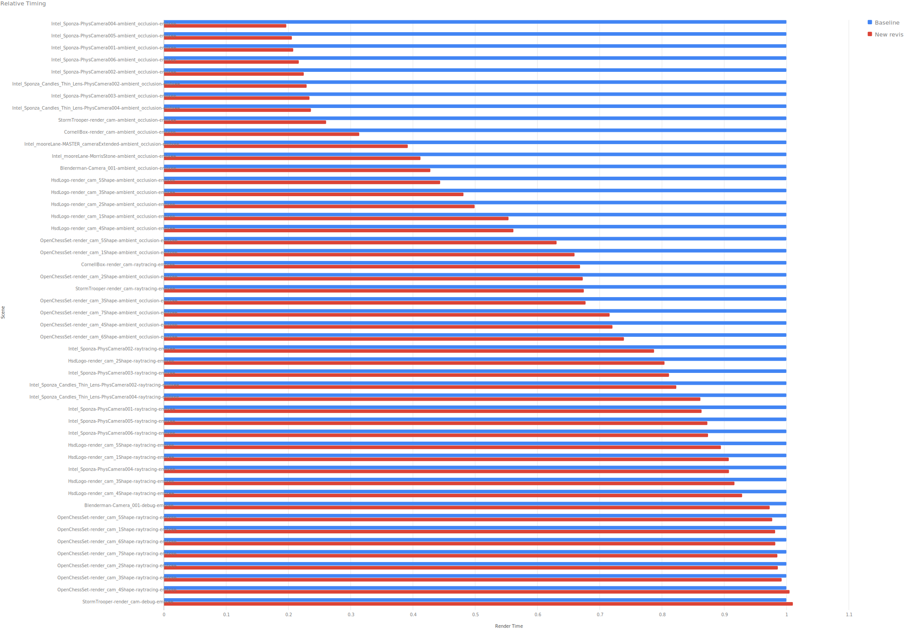
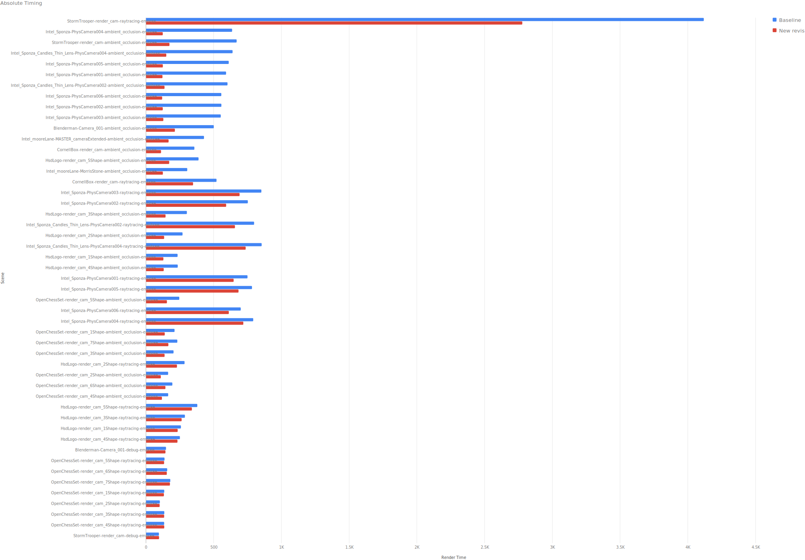
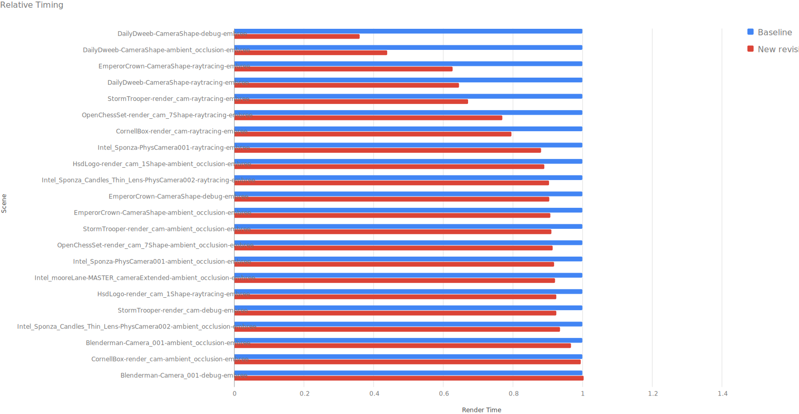
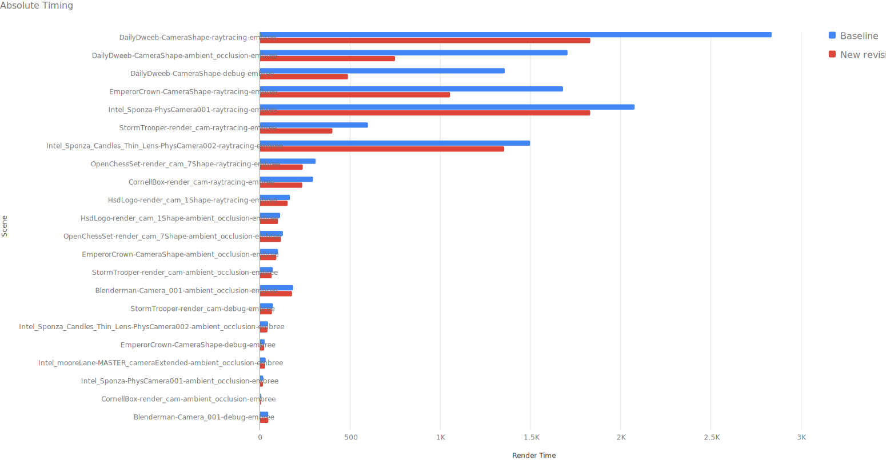
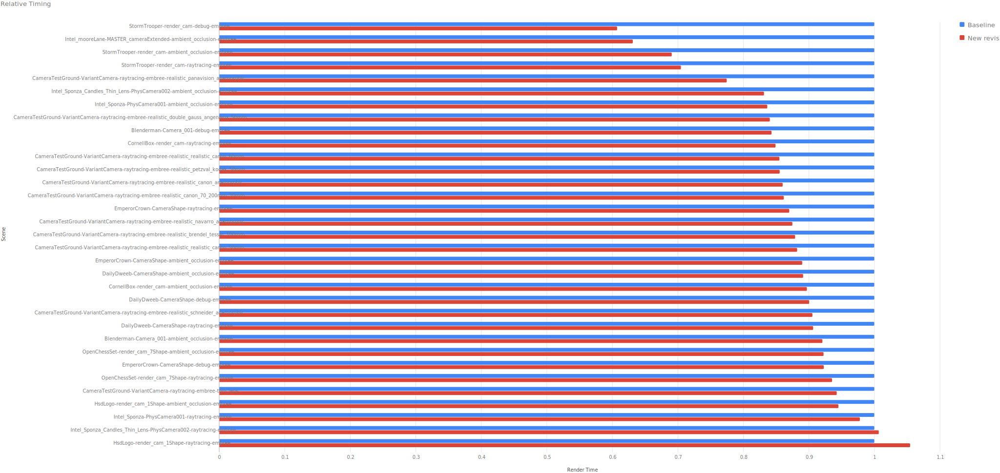
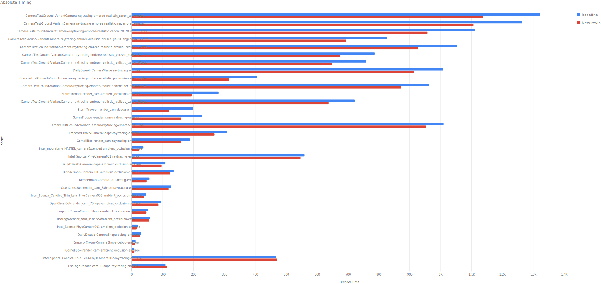

# Implementation Diary

## 27.04.2023 - Spiral Bucket Sequence

First, the bucket ordering for Crayg was determined by TBB - it was essentially a `tbb::parallel_for` over all bucket,
which where generated line-by-line. Because that looked a bit _weird_, the bucket sequence was changed to be
line-by-line.

This is also not ideal, because usually the most interesting part of the image is in the middle and not on the top of
the image. That's why a spiral bucket sequence would be more useful.

To not create any performance regressions, some measurements where taken. No clear performance trend was recognizable,
some scenes where a little bit slower, some a little bit faster. I think this is just noise, so no performance
regressions where created. The Spiral Bucket Sequence will be the new default.

Cato Runs for measuring the performance:

Baseline Line-by-line: https://cato.frmbffr.com/projects/5/runs/873 \
Baseline Spiral: https://cato.frmbffr.com/projects/5/runs/874

Absolute Measurements:

Relative Measurements:

## 28.04.2023 - Adaptive Sampling Experiments

I experimented a little bit with adaptive sampling in the last days. I implemented the adaptive sampling inspired
by [Dammertz et al.’s paper, "A Hierarchical Automatic Stopping Condition for Monte Carlo Global Illumination"](https://jo.dreggn.org/home/2009_stopping.pdf).

The method works by subdividing image regions recursively, based on an error metric. If the metric for a block is below
a certain split threshold, the block is split and further refoned, if the metric is below a certain termination
threshold, the block is considered done. For the error metric they compute a weighted difference between the final pixel
color with all samples and the pixel color with half the samples, which is fast to compute and yields good results.
Details can be found in the paper.

For the first experiments, I skipped the hierarchical part and just rendered the image in 8x8 pixel blocks and
terminated them using the error metric by Dammertz et al. I decided to skip the hierarchy, because using 8x8 blocks was
just simpler and since multiple threads would need to update the error hierarchy, I was afraid to get this working
correctly in a performant way. Later, I found out that Dreamworks
published [a paper](https://dl-acm-org.ezp.hs-duesseldorf.de/doi/10.1145/3306307.3328205) about their adaptive sampling
implementation in MoonRay. They used to use an approach similiar to mine (8x8 pixels blocks, Dammertz et al.’s error
metric, no hierarchy), but they found that this leads to undersampling for low-probability effects such as caustics.
However, for a general test how adaptive sampling can improve render times, we are going to ignore this issues. Note
that since a few weeks, MoonRay ist available as Open Source and the adaptive sampling implementation can be
found [here](https://github.com/dreamworksanimation/moonray/blob/ba155b14779586254212c6973421ac2e7fcb47e9/lib/rendering/rndr/adaptive/AdaptiveRegionTree.h).

First tests during development have shown that adaptive sampling can improve the render time quite a bit. To get some
real numbers, I run some test over a number of test scenes I collected over time. I rendered the scenes twice with
adaptive/non-adaptive sampling with a maximum of 1024ssp (so the non-adaptive rendering was done with 1024ssp and the
adaptive version chose a sufficient amount of samples <= 1024). The cato test runs can be found
here: [uniform sampling](https://cato.frmbffr.com/projects/5/runs/873), [adaptive sampling](https://cato.frmbffr.com/projects/5/runs/879)

There was quite some time saving of almost two hours (6h 32min for non-adaptive, 4h 40min for adaptive). The rendered
images are visually identical. The greatest improvement was shown by scenes with a lot of constant areas. The Ambient
Occlusion scenes benefited a lot from that and showed the greatest improvements. The raytraced Intel Sponza scenes
however showed the least improvement (some scenes took also longer to render). I think the issue is, that many parts of
the scene are lit by GI and they always require the maximum sample number. Some Intel Sponza scenes where faster, but
they also have larger areas that are not only illuminated by GI. I think the increase in rendertime is due to the
evalutation of the error metric, which is actually not very useful if the whole image just needs the maximum sample
number.

### Conclusion and future plans:

Until now, I skipped the hierarchy part. I am not sure, how much the sampling would benefit from using the hierarchy.
Also, a thread-safe implementation would be challenging. Since Dreamworks found that not using the hierarchy is only an
issue for low-probability effects such as caustics, I think it will be fine to go without the hierarchy. Right now,
Crayg has no such effects and it will take some time to add them. So adding the hierarchy at some point is probably ok.

### Graphs

Absolute Measurements:

Relative Measurements:

## 28.04.2023 - Use occlusion rays with tMax for shadow rays and ambient occlusion

For "historic reasons", crayg did not use the full power of occlusion rays for shadow rays and ambient occlusion.
Mainly, because the interface was broken and I did not want to fix the naive BVH implementation. Also, some measurements
showed in the past, that the benefit was not that huge. It turns out that this measurements where just wrong.

Since crayg uses Embree for quite some time now, I decided to drop the old naive BVH implementation, since its slower in
ray tracing and _way_ slower to construct than the Embree BVH (the naive BVH was not constructed multithreaded for
example).

The scenes that benefited the most where the ambient occlusion scenes, I was able to reduce render times down to 20% of
the original render time (10min to 2min). But also all other scenes benefited greatly from that. Note that with adaptive
sampling, the render time for some AO scenes could be reduced from 10min to about 20 sec in some scenes

Cato Runs for measuring the performance:

Baseline Line-by-line: https://cato.frmbffr.com/projects/5/runs/873 \
Baseline Spiral: https://cato.frmbffr.com/projects/5/runs/873

### Graphs

Relative Largest improvements:

Absolute Largest improvements:

## 28.07.2023 - Replace std::pow(x,2) in performance critical sections with explicit multiplication

During the development of my master thesis, I became aware of the fact that using `std::pow` to compute square of a
number can be really slow, especially, if the exponent is two and the calculatioon could be done easily without `std::pow`.
When I initially wrote Crayg, I chose to use `std::pow` because I think the intention of the code is more clear.
However, as it turns out the functions using `std::pow` are called quite often, since the critical sections they were used are the `length()` or `squaredLength()` methods of vectors;
Because using the length of a vector is so common during raytracing, this could have a potentially large impact on
performance.

As you can see in commit [b5b1c1](https://github.com/Latios96/crayg/commit/b5b1c1e94d5652eed400e0bb31176e684c208046), the change was pretty simple, only a few places
needed to be changed. To get an overview over the performance gain, I benchmarked the code using my test scene
collection. Only the hero cameras were rendered and 64 was chosen as a max samples number.

Almost every scene rendered faster after this small change. The speed improvement was most dominant in the DailyDweeb
scene, which rendered in one case in only 36% of the baseline time.
The DailyDweeb scene was rendered using the RealisticCamera and a Canon 70-200mm lens with 34 elements.
When tracing the ray through the elements of the lens, at each intersection it's checked if the ray escaped the lens.
This involves a length calculation, so the scene benefited heavily from this performance improvement.

### Graphs

Relative Largest improvements:

Absolute Largest improvements:

## 04.11.2023 - inline basic methods

I started to inline some of the most basics methods in crayg (e.g. Vector3f, Color and other classes, see [a60b06](https://github.com/Latios96/crayg/commit/a60b0645561beee552176a4f7d8f570499079923)).
This led to a substential performance boost (up to 60%).

Relative Largest improvements:

Absolute Largest improvements:

Baseline: https://cato.frmbffr.com/projects/5/runs/1216 \
With Inlining: https://cato.frmbffr.com/projects/5/runs/1217