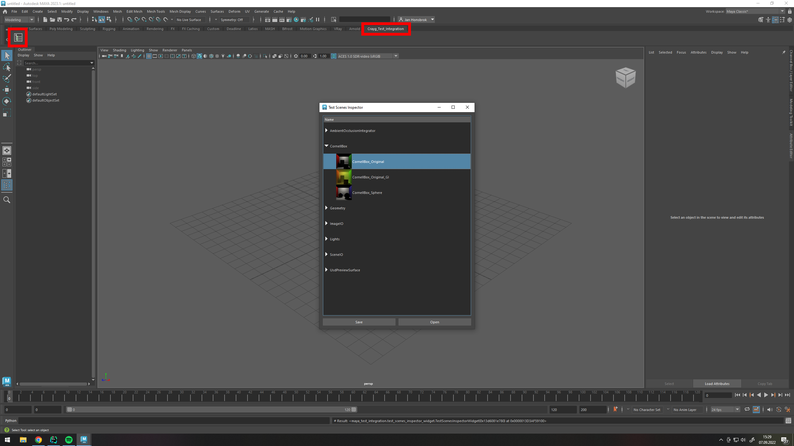

# Test Integration for Autodesk Maya

Qt / Python based tool for easy authoring of integration test scenes inside of Autodesk Maya

For each test, a Maya `.ma` file and a `.usda` file is stored

## Prerequisites

Currently, Autodesk Maya 2023 is supported.
You need to have the [maya-usd](https://github.com/Autodesk/maya-usd) installed

(install dependencies)

## Launching and Usage

Start Maya with the test integration via command line:

```shell
cd src\mayaTestIntegration
start_maya.bat
```

When Maya is open, a new Shelf is added. Use the Inspector Icon to launch the test integration:


The Test Integration will present you the suites / tests as a tree view


### Functions

#### Open

Opens the .ma file associated with the test

#### Save

Saves the currently open test as a `.ma` file and exports scene to `.usda`

#### Create a new Suite or Test

Suite: right-click into tree view
Test: right-click on a suite

